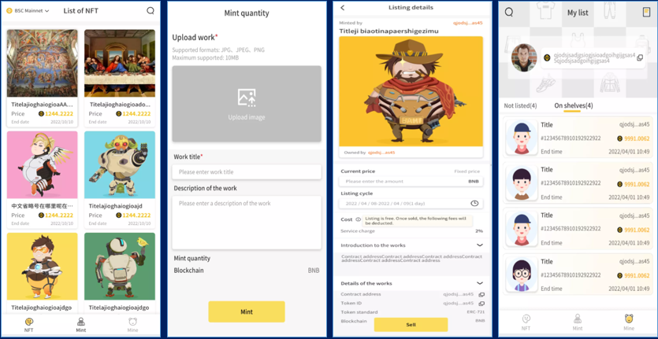

# NFT Treasure Chest




NFT Treasure Chest provide creators with multimedia data (files, pictures, audio, video) on-chain permanent storage and other core functions and services. At the same time, for each work of the creator, it is supported to be directly cast as an NFT. Once the NFT is cast on the chain, creators can sell their work as an NFT. In this way, the issue of revenue for content creators is solved. Creators can also permanently store their works on the cloud disk platform to ensure the permanent storage of their works.


*Warning* This project is still **pre-release** and is not ready for production usage.

[](https://raw.githubusercontent.com/ipdr/ipdr/master/LICENSE)
[](https://github.com/emersion/stability-badges#experimental)
[](#contributing)
[](https://github.com/RichardLitt/standard-readme)


```
npm install
```

### Compiles and hot-reloads for development
```
npm run serve
```

### Compiles and minifies for production
```
npm run build
```

### Lints and fixes files
```
npm run lint
```

### Customize configuration
See [Configuration Reference](https://cli.vuejs.org/config/).


## License

MIT © 2021 lindensys.com